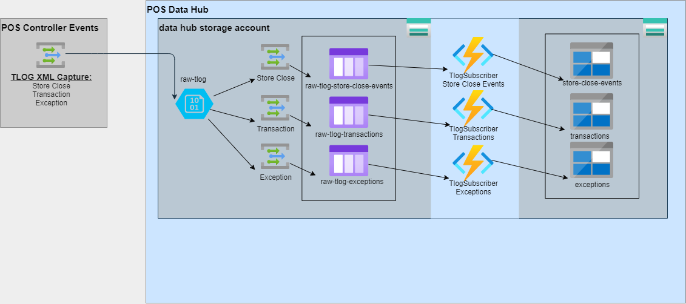

# ADR-002: Inbound + Outbound naming convention for TLOG Data

## Status
- Accepted (2021-08-19) @ 3:00pm


## Members who attended :
- [x] Michael Zobel (Dev POS)
- [x] Chris Orlando (Dev POS)
- [x] Jagreet Atwal (Toshiba)
- [x] Mike Wolford (EA)
- [x] Adam Weigert (EA)

## Context

- Raw TLOG data flowing from controllers have three main *buckets*:
    1. Store close events
    2. Transaction
    3. Exceptions
- Raw TLOG names should reflect which *bucket* it belongs to.


## Decision
---
### Inbound:
```
1. The close string:
    /YYYY/MM/DD/HH/{store}_{milliseconds}_storecloseevent.xml

2. The transaction string:
    /YYYY/MM/DD/HH/{store}_{lane}_{trans#}_{milliseconds}_transaction.xml

3. The exception string:
    /YYYY/MM/DD/HH/{store}_{lane}_{trans#}_{milliseconds}_exception.xml
```
Toshiba will name the files based on controller transaction time YYYYMMDDHH and **not** azure.

### Outbound:
```
1. store-close-events/v1/YYYY/MM/DD/HH/{store}_{milliseconds}.json

2. transactions/v1/YYYY/MM/DD/HH/{store}_{lane}_{trans#}.json

3. exceptions/v1/YYYY/MM/DD/HH/{store}_{lane}_{trans#}_{milliseconds}.json
```
XML to JSON solution will add full source Uri to JSON output for support reasons. Since we are manipulating the outbound name we need a reference to point to the source. 

Write outbound name based on information in the xml. 

---

## Consequences

- Reduce implementation changes on ACE/DIF (Toshiba).
- Reduce overhead of creating new *triggers* per Data Asset Type.

## Supporting Documentation


